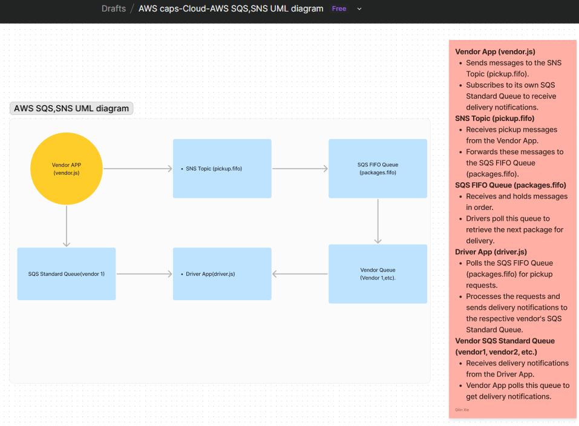

# CAPS Cloud System
Using only AWS Services: SQS, SNS, and client applications, create a cloud version of the CAPS system.

## Introduction
The CAPS (Cloud-based Application Package System) leverages AWS services to create a scalable, reliable, and efficient package delivery system using SNS, SQS, and Node.js applications.

## Architecture
[UML Diagram](https://www.figma.com/board/2V2QzG9MefeeBj24u3SyFM/AWS-caps-Cloud-AWS-SQS%2CSNS-UML-diagram?node-id=0-1&t=VIZImrbirnMU3zly-0) : 

- **SNS Topic:** pickup.fifo
- **SQS FIFO Queue:** packages.fifo
- **Vendor SQS Standard Queues:** vendor1, vendor2, etc.
- **Vendor Application:** Sends pickup requests and receives delivery notifications.
- **Driver Application:** Processes packages and sends delivery notifications.

## Setup Instructions
1. **Clone the Repository**
   ```sh
   git clone https://github.com/qilinxie02/caps-cloud.git
   cd caps-cloud
